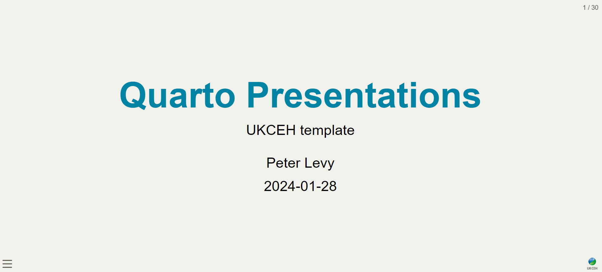

# stats_intro slides

`R` Quarto slides for html format presentation for CEH Data Day Intro to Statistics session.

## Example Title Slide

Here is the title slide:



## Full Presentation via GitHub Pages

Example presentation at [https://nerc-ceh.github.io/stats_intro/](https://nerc-ceh.github.io/stats_intro/). 

## Usage
This presentation is based on the CEH Quarto template at [https://nerc-ceh.github.io/ceh_quarto_slides/](https://nerc-ceh.github.io/ceh_quarto_slides/). 

Just fork that and edit the front-matter YAML at the start of your .Rmd or .qmd file containing your presentation.


```
---
title: "your title"
subtitle: "subtitle"
author: "Your name"
date: "UKCEH </br> `r Sys.Date()`"
format:
  revealjs:
    theme: [default, ceh.scss]  
    slide-number: true
    chalkboard: 
      buttons: false
    preview-links: auto
    logo: images/logo/UKCEH-Logo_Short_Positive_RGB.png
---

```

## Rendering html from Rmarkdown
To produce the html slides from the R markdown file (.Rmd or .qmd), we run the command:

`quarto::quarto_render("./index.qmd")`

or use the knit button in Rstudio. If your system fails to find quarto, set the path and make sure the quarto library is installed:

```
# use quarto installed with Rstudio; set path first time
# Sys.setenv(QUARTO_PATH="C:/Program Files/RStudio/resources/app/bin/quarto/bin/quarto.exe")
library(quarto)
quarto_render("./index.qmd")`
```

To run this template, you will need to install the packages it uses for the examples e.g.

```
install.packages("leaflet")
# or if you use renv:
# renv::install("leaflet")
```

